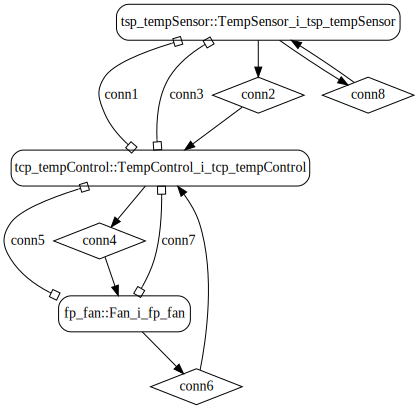
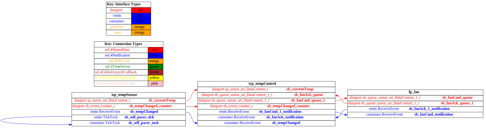

# Temperature Control with seL4 Domain Scheduling

 Table of Contents
  * [Diagrams](#diagrams)
    * [AADL Arch](#aadl-arch)
    * [SeL4](#sel4)
      * [SeL4 CAmkES Arch](#sel4-camkes-arch)
      * [SeL4 CAmkES HAMR Arch](#sel4-camkes-hamr-arch)
  * [Metrics](#metrics)
    * [AADL Metrics](#aadl-metrics)
    * [Linux Metrics](#linux-metrics)
    * [SeL4 Metrics](#sel4-metrics)
  * [Run Instructions](#run-instructions)
    * [Linux](#linux)
    * [SeL4](#sel4)

## Diagrams
### AADL Arch


### SeL4
#### SeL4 CAmkES Arch


#### SeL4 CAmkES HAMR Arch


## Metrics
### AADL Metrics
| | |
|--|--|
|Threads|3|
|Ports|9|
|Connections|4|

### Linux Metrics
Directories Scanned Using [https://github.com/AlDanial/cloc](https://github.com/AlDanial/cloc) v1.88:
- [hamr/c/ext-c](hamr/c/ext-c)
- [hamr/c/nix](hamr/c/nix)

<u><b>Total LOC</b></u>

Total number of HAMR-generated transpiled Slang and developer-written C lines of code

Language|files|blank|comment|code
:-------|-------:|-------:|-------:|-------:
C|194|2176|281|12387
C/C++ Header|373|3280|324|8849
C++|1|113|52|498
--------|--------|--------|--------|--------
SUM:|568|5569|657|21734

<u><b>User LOC</b></u>

The number of lines of code written by the developer in [hamr/c/ext-c](hamr/c/ext-c).
The Slang-based component implementations were excluded by the transpiler so this represents the number of lines of C code needed to realize the component behaviors.
"Log" are lines of code used for logging that
likely would be excluded in a release build

|Type|code |
|--|--:|
|Behavior|74|
|Log|45|
|--------|--------|
|SUM:|119|

### SeL4 Metrics
Directories Scanned Using [https://github.com/AlDanial/cloc](https://github.com/AlDanial/cloc) v1.88:
- [hamr/c/ext-c](hamr/c/ext-c)
- [hamr/camkes](hamr/camkes)

<u><b>Total LOC</b></u>

Total number of HAMR-generated CAmkES, transpiled Slang, and developer-written C lines of code

Language|files|blank|comment|code
:-------|-------:|-------:|-------:|-------:
C|156|1759|411|9357
C/C++ Header|277|2428|328|6609
CAmkES|4|4|1|71
--------|--------|--------|--------|--------
SUM:|446|4331|766|17402

<u><b>User LOC</b></u>

The number of lines of code written by the developer [hamr/c/ext-c](hamr/c/ext-c) .
The Slang-based component implementations were excluded by the transpiler so this represents the number of lines of C code needed to realize the component behaviors.
"Log" are lines of code used for logging that
likely would be excluded in a release build
|Type|code |
|--|--:|
|Behavior|74|
|Log|45|
|--------|--------|
|SUM:|119|

## Run Instructions
*NOTE:* actual output may differ due to issues related to thread interleaving
### Linux

  |HAMR Codegen Configuration| |
  |--|--|
  | package-name | t |
  | exclude-component-impl | true |
  | bit-width | 32 |
  | max-string-size | 256 |
  | max-array-size | 1 |


  **How To Run**
  ```
  aeic2022_temperature_control/hamr/slang/bin/transpile.cmd
  aeic2022_temperature_control/hamr/c/bin/compile.cmd
  aeic2022_temperature_control/hamr/c/bin/run.sh
  aeic2022_temperature_control/hamr/c/bin/stop.sh
  ```


### SeL4

  |HAMR Codegen Configuration| |
  |--|--|
  | package-name | t |
  | exclude-component-impl | true |
  | bit-width | 32 |
  | max-string-size | 256 |
  | max-array-size | 1 |


  **How To Run**
  ```
  aeic2022_temperature_control/hamr/slang/bin/transpile-sel4.cmd
  aeic2022_temperature_control/hamr/camkes/bin/run-camkes.sh -s
  ```
