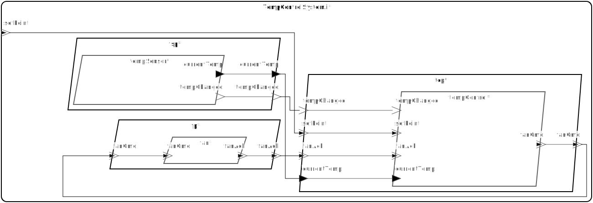
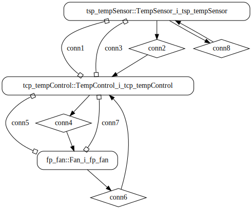

# temperature-control

## Diagrams

### AADL Arch


## seL4 Arch


## Run Instructions

### Linux
```
temperature-control/hamr/slang/bin/transpile.cmd
temperature-control/hamr/c/bin/compile.cmd
temperature-control/hamr/c/bin/run.sh
temperature-control/hamr/c/bin/stop.sh
```

[Example Output](#linux-example-output)

### seL4
```
temperature-control/hamr/slang/bin/transpile-sel4.cmd
temperature-control/hamr/camkes/bin/run-camkes.sh -s
```

[Example Output](#sel4-example-output)

## Example Output

### Linux Example Output
```
Using the round robin order provided in architecture/t/Schedulers.scala. Edit method 
  t_ScheduleProviderI_getRoundRobinOrder located in round_robin.c
to supply your own
Art: Registered component: TempControlSystem_i_Instance_tsp_tempSensor (periodic: 1000)
Art: - Registered port: TempControlSystem_i_Instance_tsp_tempSensor_currentTemp (data out)
Art: - Registered port: TempControlSystem_i_Instance_tsp_tempSensor_tempChanged (event out)
Art: Registered component: TempControlSystem_i_Instance_tcp_tempControl (sporadic: 1)
Art: - Registered port: TempControlSystem_i_Instance_tcp_tempControl_currentTemp (data in)
Art: - Registered port: TempControlSystem_i_Instance_tcp_tempControl_fanAck (event in)
Art: - Registered port: TempControlSystem_i_Instance_tcp_tempControl_setPoint (event in)
Art: - Registered port: TempControlSystem_i_Instance_tcp_tempControl_fanCmd (event out)
Art: - Registered port: TempControlSystem_i_Instance_tcp_tempControl_tempChanged (event in)
Art: Registered component: TempControlSystem_i_Instance_fp_fan (sporadic: 1)
Art: - Registered port: TempControlSystem_i_Instance_fp_fan_fanCmd (event in)
Art: - Registered port: TempControlSystem_i_Instance_fp_fan_fanAck (event out)
Art: Connected ports: TempControlSystem_i_Instance_tsp_tempSensor_currentTemp -> TempControlSystem_i_Instance_tcp_tempControl_currentTemp
Art: Connected ports: TempControlSystem_i_Instance_tsp_tempSensor_tempChanged -> TempControlSystem_i_Instance_tcp_tempControl_tempChanged
Art: Connected ports: TempControlSystem_i_Instance_tcp_tempControl_fanCmd -> TempControlSystem_i_Instance_fp_fan_fanCmd
Art: Connected ports: TempControlSystem_i_Instance_fp_fan_fanAck -> TempControlSystem_i_Instance_tcp_tempControl_fanAck
TempControlSystem_i_Instance_tsp_tempSensor: Initialized bridge: TempControlSystem_i_Instance_tsp_tempSensor
TempControlSystem_i_Instance_tcp_tempControl: Initialized bridge: TempControlSystem_i_Instance_tcp_tempControl
TempControlSystem_i_Instance_fp_fan: Initialized bridge: TempControlSystem_i_Instance_fp_fan
TempControlSystem_i_Instance_tsp_tempSensor: Sensed: Temperature_i(84.000000, Fahrenheit)
TempControlSystem_i_Instance_tcp_tempControl: Received: Temperature_i(84.000000, Fahrenheit)
TempControlSystem_i_Instance_tcp_tempControl: Temperature ok:
TempControlSystem_i_Instance_tsp_tempSensor: Sensed: Temperature_i(88.000000, Fahrenheit)
TempControlSystem_i_Instance_tcp_tempControl: Received: Temperature_i(88.000000, Fahrenheit)
TempControlSystem_i_Instance_tcp_tempControl: Temperature ok:
TempControlSystem_i_Instance_tsp_tempSensor: Sensed: Temperature_i(92.000000, Fahrenheit)
TempControlSystem_i_Instance_tcp_tempControl: Received: Temperature_i(92.000000, Fahrenheit)
TempControlSystem_i_Instance_tcp_tempControl: Temperature ok:
TempControlSystem_i_Instance_tsp_tempSensor: Sensed: Temperature_i(96.000000, Fahrenheit)
TempControlSystem_i_Instance_tcp_tempControl: Received: Temperature_i(96.000000, Fahrenheit)
TempControlSystem_i_Instance_tcp_tempControl: Temperature ok:
TempControlSystem_i_Instance_tsp_tempSensor: Sensed: Temperature_i(100.000000, Fahrenheit)
TempControlSystem_i_Instance_tcp_tempControl: Received: Temperature_i(100.000000, Fahrenheit)
TempControlSystem_i_Instance_tcp_tempControl: Temperature ok:
TempControlSystem_i_Instance_tsp_tempSensor: Sensed: Temperature_i(104.000000, Fahrenheit)
TempControlSystem_i_Instance_tcp_tempControl: Received: Temperature_i(104.000000, Fahrenheit)
TempControlSystem_i_Instance_tcp_tempControl: Sent fan command: On
TempControlSystem_i_Instance_fp_fan: received fanCmd On
TempControlSystem_i_Instance_fp_fan: Actuation result: Ok
TempControlSystem_i_Instance_tcp_tempControl: received fanAck Ok
TempControlSystem_i_Instance_tcp_tempControl: Actuation worked!
TempControlSystem_i_Instance_tsp_tempSensor: Sensed: Temperature_i(100.000000, Fahrenheit)
TempControlSystem_i_Instance_tcp_tempControl: Received: Temperature_i(100.000000, Fahrenheit)
TempControlSystem_i_Instance_tcp_tempControl: Temperature ok:
TempControlSystem_i_Instance_tsp_tempSensor: Sensed: Temperature_i(96.000000, Fahrenheit)
TempControlSystem_i_Instance_tcp_tempControl: Received: Temperature_i(96.000000, Fahrenheit)
TempControlSystem_i_Instance_tcp_tempControl: Temperature ok:
TempControlSystem_i_Instance_tsp_tempSensor: Sensed: Temperature_i(92.000000, Fahrenheit)
TempControlSystem_i_Instance_tcp_tempControl: Received: Temperature_i(92.000000, Fahrenheit)
TempControlSystem_i_Instance_tcp_tempControl: Temperature ok:
TempControlSystem_i_Instance_tsp_tempSensor: Sensed: Temperature_i(88.000000, Fahrenheit)
TempControlSystem_i_Instance_tcp_tempControl: Received: Temperature_i(88.000000, Fahrenheit)
TempControlSystem_i_Instance_tcp_tempControl: Temperature ok:
^CTempControlSystem_i_Instance_tsp_tempSensor: Finalized bridge: TempControlSystem_i_Instance_tsp_tempSensor
TempControlSystem_i_Instance_tcp_tempControl: Finalized bridge: TempControlSystem_i_Instance_tcp_tempControl
TempControlSystem_i_Instance_fp_fan: Finalized bridge: TempControlSystem_i_Instance_fp_fan
```

### seL4 Example Output
```
Booting all finished, dropped to user space
Entering pre-init of TempSensor_i_tsp_tempSensor
Leaving pre-init of TempSensor_i_tsp_tempSensor
Entering pre-init of TempControl_i_tcp_tempCEntering pre-init of Fan_i_fp_fan
Leaving pre-initontrol
Leaving pre-init of TempControl_i_tcp_tempControl
 of Fan_i_fp_fan
TempControlSystem_i_Instance_tsp_tempSensor: Sensed: Temperature_i(84.000000, Fahrenheit)
TempControlSystem_i_Instance_tsp_tempSensor: Sensed: Temperature_i(88.000000, Fahrenheit)
TempControlSystem_i_Instance_tcp_tempControl: Received: Temperature_i(88.000000, Fahrenheit)
TempControlSystem_i_Instance_tcp_tempControl: TemperatureTempControlSystem_i_Instance_tsp_tempSensor: Sensed: Temperature)
 ok:
TempControlSystem_i_Instance_tcp_tempControl: Received: Temperature_i(92.000000, Fahrenheit)
TempControlSystem_i_Instance_tcp_tempControl: Temperature ok:
TempControlSystem_i_Instance_tsp_tempSensor: Sensed: Temperature_i(96.000000, Fahrenheit)
TempControlSystem_i_Instance_tcp_tempControl: Received: Temperature_i(96.000000, Fahrenheit)
TempControlSystem_i_Instance_tcp_tempControl: Temperature ok:
TempControlSystem_i_Instance_tsp_tempSensor: Sensed: Temperature_i(100.000000, Fahrenheit)
TempControlSystem_i_Instance_tcp_tempControl: Received: Temperature_i(100.000000, Fahrenheit)
TempControlSystem_i_Instance_tcp_tempControl: Temperature ok:
TempControlSystem_i_Instance_tsp_tempSensor: Sensed: Temperature_i(104.000000, Fahrenheit)
TempControlSystem_i_Instance_tcp_tempControl: Received: Temperature_i(104.000000, Fahrenheit)
TempControlSystem_i_Instance_tcp_tempControl: Sent fan command: On
TempControlSystem_i_Instance_tsp_tempSensor: Sensed: Temperature_i(100.000000, Fahrenheit)
TempControlSystem_i_Instance_tcp_tempControl: Received: Temperature_i(100.000000, Fahrenheit)
TempControlSystem_i_Instance_tcp_tempControl: Temperature ok:
TempControlSystem_i_Instance_fp_fan: received fanCmd On
TempControlSystem_i_Instance_fp_fan: Actuation result: Ok
TempControlSystem_i_Instance_tsp_tempSensor: Sensed: Temperature_i(96.000000, Fahrenheit)
TempControlSystem_i_Instance_tcp_tempControl: received fanAck Ok
TempControlSystem_i_Instance_tcp_tempControl: Actuation worked!
TempControlSystem_i_Instance_tcp_tempControl: Received: Temperature_i(96.000000, Fahrenheit)
TempControlSystem_i_Instance_tcp_tempControl: Temperature ok:
TempControlSystem_i_Instance_tsp_tempSensor: Sensed: Temperature_i(92.000000, Fahrenheit)
TempControlSystem_i_Instance_tcp_tempControl: Received: Temperature_i(92.000000, Fahrenheit)
TempControlSystem_i_Instance_tcp_tempControl: Temperature ok:
TempControlSystem_i_Instance_tsp_tempSensor: Sensed: Temperature_i(88.000000, Fahrenheit)
TempControlSystem_i_Instance_tcp_tempControl: Received: Temperature_i(88.000000, Fahrenheit)
TempControlSystem_i_Instance_tcp_tempControl: Temperature ok:
```